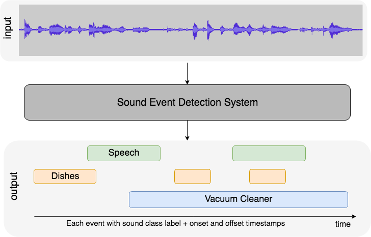

# Sound event detection system



## Introduction

This repository contains the code for training and evaluating sound event detection system.  
System is trained on the [DCASE 2019 Task 4](http://dcase.community/challenge2019/task-sound-event-detection-in-domestic-environments) dataset.

Sound event detection model is trained using `PyTorch` and `PyTorch Lightning` frameworks. All the experiments are logged using `DVC` for reproducibility and artifacts tracking.

## Usage

First, download the dataset from the [official website](http://dcase.community/challenge2019/task-sound-event-detection-in-domestic-environments) and extract it to the `DESED_dataset` directory. You will have to change the paths in `params.yaml` to match your directory structure. You can use this command:  

```bash
sed -i 's|/mnt/d/DESED_dataset|<YOUR_DATA_DIR>/DESED_dataset|g' params.yaml
```

Directory tree should look like this:

```bash
DESED_dataset
├── audio (2)
│   ├── train (4)
│   │   ├── strong_label_real (3470)
│   │   ├── unlabel_in_domain (14412)
│   │   └── weak (1578)
│   └── validation (2)
│       └── validation (1168)
├── dcase_synth (2)
│   ├── audio (2)
│   │   ├── train (1)
│   │   │   └── synthetic21_train (1)
│   │   │       └── soundscapes (30000)
│   │   └── validation
│   │       └── synthetic21_validation (1)
│   │           └── soundscapes (7500)
│   └── metadata (2)
│       ├── train (1)
│       │   └── synthetic21_train (1)
│       └── validation (1)
│           └── synthetic21_validation (2)
└── metadata (2)
    ├── train (4)
    │   └── synthetic21_train (1)
    └── validation (4)
        └── synthetic21_validation (2)
```

Next, create conda environment with `python 3.8.5` and install the required packages using the following command:

```bash
conda env create -n env_name python=3.8.5
pip install -r requirements.txt
```

To train the model, run the following command:

```bash
python run_training.py
```

For model output visualization and error analysis purpose, `streamlit` app is used. You can run the app using the following command:

```bash
cd app/
streamlit run app.py
```
